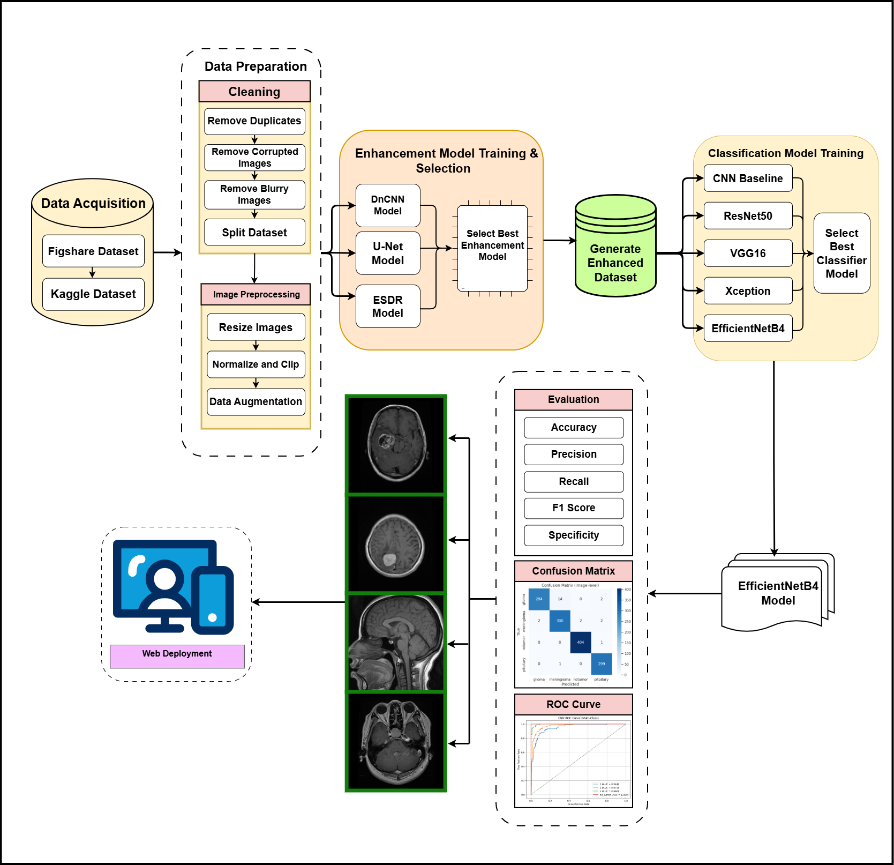
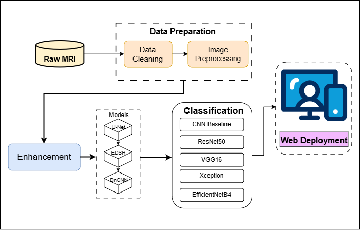
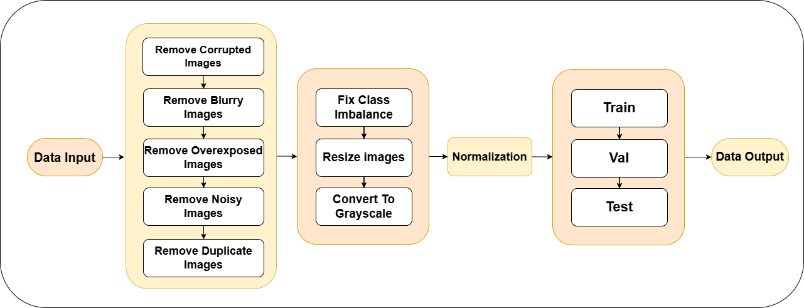

# **AI-Powered Brain MRI Enhancement, Classification & Diagnostic Assistance**

## **📌 Project Title**

**A Deep Learning–Based End-to-End System for Brain MRI Enhancement, Tumor Classification & Clinical Decision Support**

---

# **1. Introduction**

Brain tumors such as **glioma, meningioma, and pituitary adenomas** require timely and accurate diagnosis. Manual reading of MRI scans is time-consuming, error-prone, and heavily dependent on radiologist experience.

This project presents a complete **end-to-end AI pipeline** that:

* Enhances MRI scans using deep learning–based restoration models
* Automatically classifies tumor type using EfficientNet
* Offers explainability and user-friendly web deployment
* Bridges the gap between AI systems and clinical workflows

The system integrates **image enhancement → classification → visualization** into a unified tool usable by clinicians, students, and patients.

---

# **2. High-Level Workflow**

### **Complete Architecture Overview**



---

# **3. Project Objectives**

1. **Enhance Medical Images** – Reduce noise, motion blur, and poor contrast.
2. **Detect Abnormalities Accurately** – Identify tumors such as glioma, meningioma, and pituitary lesions with high precision.
3. **Provide Explainable AI Results** – Highlight exact image regions influencing predictions.
4. **Improve Accessibility & Understanding** – Provide a web/mobile interface with simple, understandable results.

---

# **4. Literature Review Summary**

* Traditional ML required hand-crafted features → inconsistent results.
* Deep CNNs outperform older approaches due to automatic feature learning.
* Enhancement models significantly improve diagnostic interpretability.
* EfficientNet architectures optimize accuracy vs. model size.
* There is a growing need for **explainable, reliable, deployable AI** in radiology.

---

# **5. System Architecture (Simplified)**



---

# **6. Detailed Data Processing Pipeline**



---

# **7. Enhancement Models Implemented**

| Model     | Purpose                | Strengths                    |
| --------- | ---------------------- | ---------------------------- |
| **DnCNN** | Denoising              | Removes Gaussian noise       |
| **EDSR**  | Super-resolution       | Recovers fine structures     |
| **U-Net** | Structural restoration | Best PSNR & SSIM performance |

### **Selected Enhancement Model: U-Net**

* SSIM: **0.9066**
* PSNR: **32.45 dB**
* Best structure preservation → chosen as the final enhancement module.

---

# **8. Classification Models Evaluated**

| Model               | Notes                                |
| ------------------- | ------------------------------------ |
| Simple CNN          | Baseline                             |
| VGG16               | Good accuracy but heavy              |
| ResNet50            | Deep residual learning               |
| Xception            | Efficient, depthwise separable conv. |
| **EfficientNet-B4** | **Best performance overall**         |

### **Final Selected Classifier: EfficientNet-B4**

* Accuracy: **≈ 98.17%**
* High precision & recall across classes
* Very low misclassification rate

---

# **9. Dataset, Splits & Augmentation**

Dataset includes four classes:

```
glioma/
meningioma/
pituitary/
no_tumor/
```

### **Dataset Split**

* **70%** Training
* **20%** Validation
* **10%** Testing

### **Augmentation Includes**

* Flips
* Rotation
* Zoom
* Brightness shift

---

# **10. System Evaluation**

### **Classification Metrics (EfficientNet-B4)**

* Accuracy: **98.17%**
* High precision & recall
* AUC: **0.999**

### **Enhancement Metrics (U-Net)**

* SSIM: **0.9066**
* PSNR: **32.45 dB**

---

# **11. Gradio Web Application**

The web app provides:

* Image upload
* Enhancement preview
* Tumor classification
* Prediction confidence
* User-friendly UI

### **Run the App**

```bash
python gradio_app.py
```

### **Model Auto-Detection**

Supports:

* `efficientnetb4_best.h5`
* `efficientnetb4_best.keras`

---

# **12. Testing Methodology**

1. Unit tests for each module
2. Integration tests (50 random MRI images)
3. Performance evaluation using SSIM, PSNR, Accuracy, F1, ROC
4. Stress testing on noisy/low-resolution images

---

# **13. Deployment Plan**

### **Current Deployment**

* Local **Gradio** web interface

### **Future Deployment**

* FastAPI backend
* Docker containerization
* Cloud GPU hosting
* DICOM support
* Hospital PACS integration

---

# **14. Limitations**

* Works on **2D MRI slices**, not full 3D volumes
* Dataset diversity limited
* Explainability features under development
* Not clinically validated

---

# **15. Future Enhancements**

* Full **3D U-Net / nnU-Net**
* **Vision-Language Models** for automated reporting
* **Grad-CAM++** explainability
* Domain adaptation for multi-hospital data
* Severity scoring and triaging system

---

# **16. How to Use**

### Install Dependencies

```bash
pip install -r requirements.txt
```

### Run Complete System

```bash
python gradio_app.py
```

### Add Your Own Dataset

Follow folder structure:

```
glioma/
meningioma/
pituitary/
no_tumor/
```

---

# **17. Credits**

* All system design, model training, experimentation, and software integration
  were performed as part of a comprehensive academic major project.

---

# **18. License**

MIT License recommended for open-source academic work.

---


Just tell me!
